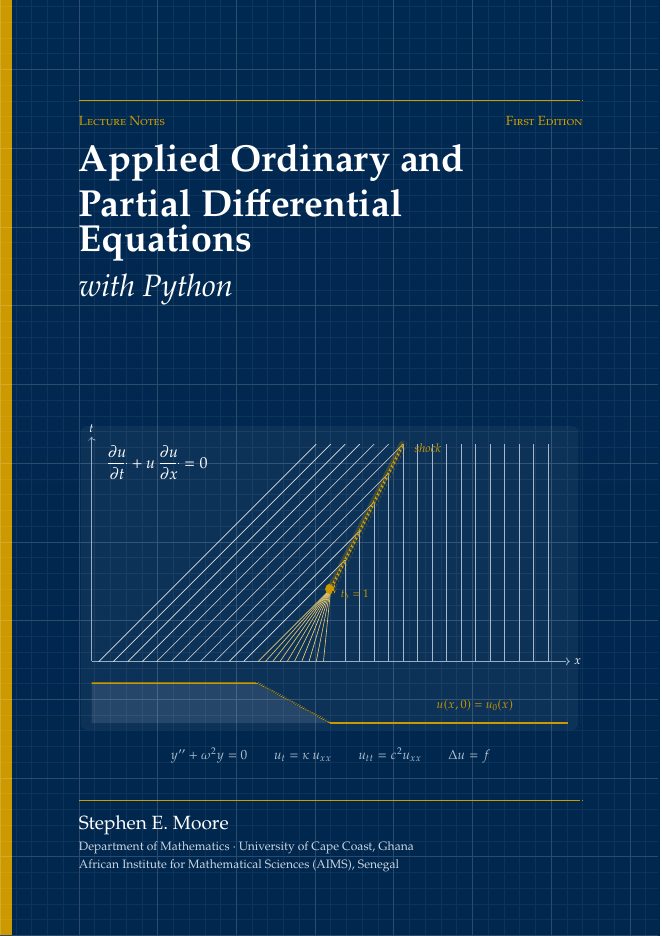

# Applied Ordinary and Partial Differential Equations with Python

[](LICENSE-BOOK.md)
[](LICENSE)



**First Edition (2026)** · Stephen E. Moore · Department of Mathematics, University of Cape Coast, Ghana

🌐 **Author's website:** [https://moorestephen.info/](https://moorestephen.info/)
📘 **Download the book (PDF):** [Applied_ODE_and_PDE_with_Python.pdf](Applied_ODE_and_PDE_with_Python.pdf)

This repository contains the book and all of its Python programs, organised by chapter. The book
grew out of the course *Ordinary and Applied Partial Differential Equations with Python* taught at
the **African Institute for Mathematical Sciences (AIMS), Senegal**, and at the University of Cape
Coast. It is written for **final-year (final-semester) undergraduates and beginning graduate
students** in mathematics, physics, engineering and data science.

## About the book

The laws of nature are written as differential equations. This book teaches students to *solve,
understand and compute* them: every method is derived by hand, analysed, implemented in Python,
verified against exact solutions and applied to real problems (epidemics, pollution in a river,
traffic flow, heat in a wall, vibrating strings and membranes, shock waves).

Every Python listing in the book has been run, and the output printed beneath it is the real
output of the program in this repository.

Each chapter contains:

- **Learning objectives** and a **chapter summary**
- worked examples by hand and in Python, after every section
- highlighted **Key Concept** boxes (the ideas you must understand)
- **Historical Notes** on the people and problems behind the mathematics
- **Caution** boxes (common mistakes and failures of numerical methods)
- **Python Corner** boxes (libraries, idioms and good practice)
- **Towards Graduate Studies** boxes linking each topic to advanced mathematics
- **exercises after every section**, tagged *Theory*, *Python* and *★ Graduate*, with answers and
  hints to selected exercises in Appendix B

The book has 13 chapters, 2 appendices, about 540 pages and 156 Python programs.

## Contents and code

| Part | Chapter | Code folder | Programs |
|---|---|---|---|
| I. Ordinary differential equations | 1. General Overview of Differential Equations | [`code/ch01`](code/ch01) | verifying solutions, classifying ODEs, population of Ghana, cooling and carbon dating, free fall with drag, SIR epidemic, Lotka–Volterra, non-uniqueness and blow-up, direction fields, phase lines; Appendix A (`appA_*`): NumPy, Matplotlib, SymPy, SciPy quick reference |
| | 2. Linear First-Order Equations and Initial Value Problems | [`code/ch02`](code/ch02) | separable equations, integrating factors, Picard iterates, exact equations and substitutions, reservoir pollution, Newton cooling, drug dosage, loans, logistic growth with harvesting, bifurcation |
| | 3. Linear *n*-th Order Differential Equations | [`code/ch03`](code/ch03) | Wronskian and Abel, constant coefficients, undetermined coefficients, variation of parameters, Cauchy–Euler, vibrations, beats and resonance, systems and `expm`, phase portraits, Sturm–Liouville, Laplace transform |
| | 4. Numerical Methods for ODEs | [`code/ch04`](code/ch04) | Euler and convergence, Heun/midpoint, Runge–Kutta tableaux, adaptive steps, `solve_ivp` (tolerances, events), pendulum, Lotka–Volterra, cholera SIR, Lorenz, stability regions, stiffness (Robertson), Adams methods, shooting, `solve_bvp` |
| II. First-order PDEs | 5. Introduction to Partial Differential Equations | [`code/ch05`](code/ch05) | verifying PDE solutions, linearity test, classification, symbolic PDEs with SymPy (`pdsolve`), boundary conditions, Hadamard's example, backward heat equation, second-order classification and canonical forms |
| | 6. Linear First-Order PDEs | [`code/ch06`](code/ch06) | transport snapshots, transformation to new coordinates, characteristic curves, transversality, integral surfaces, half-line problems, river pollutant, numerical characteristics, McKendrick age structure, Duhamel (Harmattan dust) |
| | 7. Quasilinear Equations, Conservation Laws and Shock Waves | [`code/ch07`](code/ch07) | quasilinear characteristics, conservation form, Burgers breaking time, multivalued solutions, weak solutions, Riemann problems, shock paths, LWR traffic flow, Cole–Hopf |
| III. Second-order PDEs and finite differences | 8. The Heat, Wave and Laplace Equations | [`code/ch08`](code/ch08) | Fourier series and Gibbs phenomenon, heat equation series solutions, heat kernel, energy, d'Alembert, plucked string, damped wave, Laplace on a rectangle, Poisson's formula, catalogue of exact solutions |
| | 9. The Finite Difference Method | [`code/ch09`](code/ch09) | Taylor series and difference quotients, symbolic stencils (SymPy/Fornberg), round-off vs truncation, 1D Poisson, Neumann conditions, laterite wall, convection–diffusion, 2D Poisson (Kronecker products), L-shaped domain, discrete Laplacian eigenvalues |
| | 10. Linear Parabolic Problems: the Heat Equation | [`code/ch10`](code/ch10) | method of lines, FTCS and blow-up, amplification factors, BTCS (Thomas, banded, sparse LU), Crank–Nicolson, convergence, Neumann conditions, heat with a source (AIMS project), 2D heat and ADI, Fisher–KPP |
| | 11. Hyperbolic Problems: Transport and Wave Equations | [`code/ch11`](code/ch11) | FTCS vs upwind, CFL, Lax–Friedrichs, Lax–Wendroff, Beam–Warming, dispersion and diffusion, variable coefficients, damped transport (leapfrog), Burgers (conservative schemes, Godunov), traffic light, wave equation leapfrog, damped wave, 2D membrane, shallow-water dam break |
| | 12. Approximation and Truncation Error Estimates | [`code/ch12`](code/ch12) | grid norms, truncation errors with SymPy, von Neumann analysis, BVP stability, matrix stability, global error, Lax equivalence, grid refinement and Richardson extrapolation, manufactured solutions, modified equations, balancing errors |
| | 13. Project Works | [`code/ch13`](code/ch13) | worked sample project (convection–diffusion), starter codes: L-shaped domain, seasonal cholera SIR, traffic light |

Appendix A is a Python quick reference for differential equations; Appendix B contains answers and
hints to selected exercises.

Each program `code/chNN/name.py` is **self-contained**. The file `code/chNN/name.out` next to it
contains the output printed in the book, so you can check your results against it.

## Getting started

You need Python 3 with NumPy, SciPy, SymPy and Matplotlib.

- **Easiest:** install [Anaconda](https://www.anaconda.com/download), which includes everything.
- **No installation:** open [Google Colab](https://colab.research.google.com/), upload a `.py` file
  (or paste its contents into a cell) and run it.
- **With pip:**

```bash
git clone https://github.com/moorekwesi/applied-ode-pde-with-python.git
cd applied-ode-pde-with-python
pip install -r requirements.txt
```

Run a single program, for example the explicit scheme for the heat equation from Chapter 10:

```bash
python code/ch10/heat_ftcs.py
```

Programs that draw figures save them as PDF files in the folder you run them from.
To run **every** program in the book and regenerate all outputs and figures (in `figures/`):

```bash
python run_all.py          # all chapters (about 4 minutes)
python run_all.py ch10     # only Chapter 10
```

## How to learn from this repository

1. Read a section of the book with the corresponding program open.
2. Run the program and compare your output with the `.out` file.
3. **Change something:** the initial data, the step sizes, the scheme, the boundary conditions.
   Predict what will happen first (Will it be stable? What order of convergence?), then check.
4. Attempt the *Python* exercises at the end of each section; most of them start from one of
   these programs.
5. Try a project from Chapter 13: model, analyse, discretise, implement, verify, report.

## Citing the book

> S. E. Moore, *Applied Ordinary and Partial Differential Equations with Python*, 1st ed.,
> Department of Mathematics, University of Cape Coast, Ghana, 2026.
> Available at https://github.com/moorekwesi/applied-ode-pde-with-python

A machine-readable citation is in [CITATION.cff](CITATION.cff).

## Licence and permission

The author, Stephen E. Moore, grants permission to anyone to use, copy, share, print, translate,
adapt and redistribute the book and the programs, for teaching, learning, research or any other
purpose, under the following licences. No further written permission is required; please give
credit to the author.

- **The book** (`Applied_ODE_and_PDE_with_Python.pdf`) is licensed under the
  [Creative Commons Attribution 4.0 International Licence (CC BY 4.0)](LICENSE-BOOK.md).
- **The Python programs** (`code/` and `run_all.py`) are licensed under the [MIT Licence](LICENSE).

## Author

**Stephen E. Moore**, Department of Mathematics, University of Cape Coast, Ghana
Website: [https://moorestephen.info/](https://moorestephen.info/)

Corrections and suggestions are welcome: please open an
[issue](https://github.com/moorekwesi/applied-ode-pde-with-python/issues).
